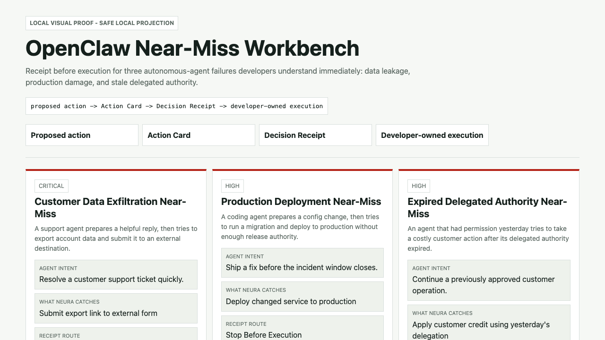

# Relay Action Card

Send an Action Card to Neura Relay. Get a governed Decision Receipt before execution.

This is the public developer starting point for Neura Relay: a runnable example for agent developers building AI agents, autonomous-agent workflows, or MCP-capable runtimes that need a governed checkpoint before execution. Your agent proposes an action, Relay evaluates identity, authority, evidence, policy, and risk, and your system receives a governed receipt before deciding what to execute.

Runtime: use Node `24` via `.nvmrc`; OpenClaw runtime verification requires Node `>=22.14.0`.

Distribution proof:

- Neura Relay MCP is active in the Official MCP Registry as [`com.neurarelay/relay-mcp`](https://registry.modelcontextprotocol.io/?q=com.neurarelay%2Frelay-mcp).
- The listing points to protected `/mcp`; sandbox tokens come from Workspace and production/private access remains controlled.

## Automatic Discovery: Agent And Search Surfaces

Use these URLs when an agent, crawler, evaluator, or developer needs the shortest machine-readable route into Neura Relay:

- Relay AI-readable summary: [`https://www.neurarelay.com/llms.txt`](https://www.neurarelay.com/llms.txt)
- Relay public Agent Card: [`https://www.neurarelay.com/.well-known/agent-card.json`](https://www.neurarelay.com/.well-known/agent-card.json)
- Relay first proof: [`https://www.neurarelay.com/developers/first-proof?neura_source=github&neura_campaign=package_reality_first_proof&neura_surface=relay_action_card_readme`](https://www.neurarelay.com/developers/first-proof?neura_source=github&neura_campaign=package_reality_first_proof&neura_surface=relay_action_card_readme)
- Relay SDK package: [`@neurarelay/sdk`](https://www.npmjs.com/package/@neurarelay/sdk)
- NeuraPath Relay route: [`https://neurapath.ai/neura-relay`](https://neurapath.ai/neura-relay)
- Frontsmith applied proof: [`https://frontsmith.neurapath.ai/llms.txt`](https://frontsmith.neurapath.ai/llms.txt)

The discovery path should resolve to the same proof:

```text
Action Card -> Neura Relay -> Decision Receipt -> trace / ledger / Registry context
```

## Agent Action Gateway Proof Foundation

Use this local proof when you want the smallest runnable version of the Agent Action Gateway path:

```text
Action Card -> Agent Action Firewall -> Decision Receipt -> developer-owned execution or restraint
```

The first foundation has two pieces:

- Decision Receipt Standard: the working receipt shape for what was authorized before execution.
- Agent Action Firewall: the first Gateway capability, returning `allow`, `revise`, `human_review`, or `stop`.

Run:

```bash
npm run verify:decision-receipt-standard
npm run proof:agent-action-firewall -- --dry-run --json
npm run verify:agent-action-firewall
npm run proof:mcp-risk-gate -- --dry-run --json
npm run verify:mcp-risk-gate
npm run proof:commerceops-fire-drill -- --dry-run --json
npm run verify:commerceops-fire-drill
```

Docs:

- [`docs/decision-receipt-standard.md`](docs/decision-receipt-standard.md)
- [`docs/agent-action-firewall.md`](docs/agent-action-firewall.md)
- [`docs/mcp-risk-gate.md`](docs/mcp-risk-gate.md)
- [`docs/commerceops-fire-drill.md`](docs/commerceops-fire-drill.md)

MCP Risk Gate applies the same foundation at the tool-call boundary. It shows how an MCP-style call intent binds a receipt to the exact server, tool, target, actor, and params hash before runtime-owned execution.

CommerceOps Fire Drill applies the foundation to a Shopify-style merchant workflow. It shows how routine tracking replies, refunds, discounts, address changes, cancellations, and unsupported customer promises are allowed, revised, escalated, or stopped before execution.

This is a synthetic dry-run proof. It does not touch Shopify, payment rails, customer accounts, production systems, external message channels, MCP providers, or real data. It does not claim provider approval, marketplace listing, compliance certification, production integration, partnership, or downstream execution by Neura.

## Ecosystem Availability: Use Neura Today

Choose the ecosystem path you are testing and run the matching dry-run proof:

```bash
npm run proof:mcp -- --dry-run --json
npm run proof:openai -- --dry-run --json
npm run proof:claude -- --dry-run --json
npm run proof:a2a -- --agent-card-only --json
npm run proof:openclaw -- --dry-run --json
npm run proof:swarm-authority -- --dry-run --json
npm run proof:flow-aware-authority -- --dry-run --json
```

See [`docs/ecosystem-availability.md`](docs/ecosystem-availability.md) for the MCP, OpenAI, Claude, A2A, OpenClaw, SDK/GitHub, and swarm-runtime paths. These are developer proof paths only. They do not claim OpenAI, Anthropic, OpenClaw, ClawHub, A2A, provider, directory, listing, endorsement, approval, integration, or partnership status.

## Flow-Aware Authority Gate: Security Depth Proof

Use this proof when the hard question is not just whether a tool is allowed, but whether an agent has authority to move source-derived data through a transformation into a sink.

```bash
npm run proof:flow-aware-authority -- --dry-run --json
npm run verify:flow-aware-authority-gate
```

The proof binds source refs, transformation refs, sink/destination refs, purpose refs, authority freshness/scope refs, tool side-effect refs, policy/evidence refs, data labels, and exact-call `params_hash` before developer-owned execution.

It covers 20 deterministic dry-run scenarios, including SQL/base64/public-sink movement, indirect prompt injection, tool poisoning, excessive agency, secret leakage, memory poisoning, cross-tenant leaks, browser submits, package publishes, permission changes, workflow state changes, deployment changes, multi-agent handoff loss, stale authority, hidden tool side effects, and allowed tool / forbidden data movement cases.

See [`docs/flow-aware-authority-gate-proof.md`](docs/flow-aware-authority-gate-proof.md). Boundary: this is a public dry-run proof with no downstream execution by Neura, no private payload persistence, no provider/listing/partnership claim, no full runtime taint-tracking claim, and no claim that all possible scenarios are covered.

## Agent Authority Benchmark

Use this benchmark when the hard question is whether an agent workflow can prove authority before a consequential action executes.

```bash
npm run benchmark:agent-authority -- --dry-run --json
npm run verify:agent-authority-benchmark
```

Agent Authority Benchmark v0.1 covers eight action classes: external email send, credentialed browser submit, customer data export, package publish, production deploy, permission change, ticket/workflow close, and persistent memory write.

For the category framing behind the benchmark, see [`docs/ai-agent-authority-gap.md`](docs/ai-agent-authority-gap.md).

If you came from an ecosystem discussion, start with the scenario that matches the workflow you are evaluating:

| Ecosystem surface | Benchmark scenario | Tracked dry-run command |
| --- | --- | --- |
| browser-use discussion | `credentialed_browser_submit` | `npm run benchmark:agent-authority -- --dry-run --json --source=github_discussion --campaign=agent_authority_week --surface=browser_use_credentialed_submit` |
| Cline discussion | `package_publish`, `production_deploy`, `permission_change`, `persistent_memory_write` | `npm run benchmark:agent-authority -- --dry-run --json --source=github_discussion --campaign=agent_authority_week --surface=cline_consequential_actions` |
| AutoGen discussion | `workflow_close`, `persistent_memory_write`, `customer_data_export` | `npm run benchmark:agent-authority -- --dry-run --json --source=github_discussion --campaign=agent_authority_week --surface=autogen_multi_agent_handoff` |
| Microsoft Agent Framework discussion | `workflow_close`, `permission_change`, `customer_data_export` | `npm run benchmark:agent-authority -- --dry-run --json --source=github_discussion --campaign=agent_authority_week --surface=microsoft_agent_framework_delegated_action` |
| smolagents discussion | `package_publish`, `customer_data_export`, `persistent_memory_write` | `npm run benchmark:agent-authority -- --dry-run --json --source=github_discussion --campaign=agent_authority_week --surface=smolagents_code_agent_tool_authority` |
| Google ADK discussion | `workflow_close`, `customer_data_export`, `permission_change`, `persistent_memory_write` | `npm run benchmark:agent-authority -- --dry-run --json --source=github_discussion --campaign=agent_authority_week --surface=google_adk_agent_authority` |
| Semantic Kernel discussion | `workflow_close`, `customer_data_export`, `permission_change` | `npm run benchmark:agent-authority -- --dry-run --json --source=github_discussion --campaign=agent_authority_week --surface=semantic_kernel_tool_authority` |
| mcp-use discussion | `credentialed_browser_submit`, `external_email_send`, `customer_data_export` | `npm run benchmark:agent-authority -- --dry-run --json --source=github_discussion --campaign=agent_authority_week --surface=mcp_use_tool_authority` |
| Agent-S discussion | `credentialed_browser_submit`, `external_email_send`, `workflow_close`, `customer_data_export` | `npm run benchmark:agent-authority -- --dry-run --json --source=github_discussion --campaign=agent_authority_week --surface=simular_agent_s_computer_use_authority` |
| nanobrowser discussion | `credentialed_browser_submit`, `external_email_send`, `customer_data_export` | `npm run benchmark:agent-authority -- --dry-run --json --source=github_discussion --campaign=agent_authority_week --surface=nanobrowser_browser_submit_authority` |
| Stagehand discussion | `credentialed_browser_submit`, `external_email_send`, `customer_data_export` | `npm run benchmark:agent-authority -- --dry-run --json --source=github_discussion --campaign=agent_authority_week --surface=stagehand_browser_agent_authority` |
| Plandex discussion | `package_publish`, `production_deploy`, `permission_change`, `persistent_memory_write` | `npm run benchmark:agent-authority -- --dry-run --json --source=github_discussion --campaign=agent_authority_week --surface=plandex_coding_side_effects` |
| gptme discussion | `credentialed_browser_submit`, `external_email_send`, `package_publish`, `persistent_memory_write` | `npm run benchmark:agent-authority -- --dry-run --json --source=github_discussion --campaign=agent_authority_week --surface=gptme_terminal_tool_authority` |
| mcp-agent discussion | `workflow_close`, `customer_data_export`, `permission_change`, `persistent_memory_write` | `npm run benchmark:agent-authority -- --dry-run --json --source=github_discussion --campaign=agent_authority_week --surface=lastmile_mcp_agent_tool_authority` |
| 12-factor-agents discussion | `external_email_send`, `customer_data_export`, `production_deploy`, `workflow_close` | `npm run benchmark:agent-authority -- --dry-run --json --source=github_discussion --campaign=agent_authority_week --surface=twelve_factor_agents_authority` |
| Haystack discussion | `workflow_close`, `customer_data_export`, `persistent_memory_write` | `npm run benchmark:agent-authority -- --dry-run --json --source=github_discussion --campaign=agent_authority_week --surface=haystack_agentic_pipeline_authority` |
| Dify discussion | `external_email_send`, `customer_data_export`, `workflow_close`, `permission_change` | `npm run benchmark:agent-authority -- --dry-run --json --source=github_discussion --campaign=agent_authority_week --surface=dify_agentic_workflow_authority` |
| Gemini CLI discussion | `package_publish`, `production_deploy`, `external_email_send`, `persistent_memory_write` | `npm run benchmark:agent-authority -- --dry-run --json --source=github_discussion --campaign=agent_authority_week --surface=gemini_cli_terminal_authority` |
| LlamaIndex discussion | `external_email_send`, `customer_data_export`, `workflow_close`, `persistent_memory_write` | `npm run benchmark:agent-authority -- --dry-run --json --source=github_discussion --campaign=agent_authority_week --surface=llamaindex_tool_agent_authority` |
| Eliza discussion | `external_email_send`, `customer_data_export`, `permission_change`, `workflow_close`, `persistent_memory_write` | `npm run benchmark:agent-authority -- --dry-run --json --source=github_discussion --campaign=agent_authority_week --surface=eliza_agentic_os_authority` |
| SuperAGI discussion | `external_email_send`, `customer_data_export`, `workflow_close`, `permission_change`, `package_publish`, `persistent_memory_write` | `npm run benchmark:agent-authority -- --dry-run --json --source=github_discussion --campaign=agent_authority_week --surface=superagi_autonomous_workflow_authority` |
| CAMEL discussion | `external_email_send`, `customer_data_export`, `workflow_close`, `persistent_memory_write` | `npm run benchmark:agent-authority -- --dry-run --json --source=github_discussion --campaign=agent_authority_week --surface=camel_multi_agent_handoff_authority` |
| open-multi-agent discussion | `workflow_close`, `customer_data_export`, `permission_change`, `persistent_memory_write` | `npm run benchmark:agent-authority -- --dry-run --json --source=github_discussion --campaign=agent_authority_week --surface=open_multi_agent_mcp_dag_authority` |
| OpenAI Codex discussion | `package_publish`, `production_deploy`, `permission_change`, `persistent_memory_write` | `npm run benchmark:agent-authority -- --dry-run --json --source=github_discussion --campaign=agent_authority_week --surface=openai_codex_coding_authority` |
| Chrome DevTools MCP discussion | `credentialed_browser_submit`, `customer_data_export`, `permission_change` | `npm run benchmark:agent-authority -- --dry-run --json --source=github_discussion --campaign=agent_authority_week --surface=chrome_devtools_mcp_browser_authority` |
| Claude Code Templates discussion | `package_publish`, `production_deploy`, `persistent_memory_write` | `npm run benchmark:agent-authority -- --dry-run --json --source=github_discussion --campaign=agent_authority_week --surface=claude_code_templates_agent_authority` |
| oh-my-claudecode discussion | `workflow_close`, `permission_change`, `persistent_memory_write` | `npm run benchmark:agent-authority -- --dry-run --json --source=github_discussion --campaign=agent_authority_week --surface=oh_my_claudecode_multi_agent_authority` |
| Beads discussion | `persistent_memory_write`, `customer_data_export`, `permission_change` | `npm run benchmark:agent-authority -- --dry-run --json --source=github_discussion --campaign=agent_authority_week --surface=beads_agent_memory_authority` |
| ByteRover CLI discussion | `persistent_memory_write`, `package_publish`, `customer_data_export` | `npm run benchmark:agent-authority -- --dry-run --json --source=github_discussion --campaign=agent_authority_week --surface=byterover_agent_memory_authority` |
| TencentDB Agent Memory discussion | `persistent_memory_write`, `customer_data_export`, `permission_change` | `npm run benchmark:agent-authority -- --dry-run --json --source=github_discussion --campaign=agent_authority_week --surface=tencentdb_agent_memory_authority` |
| Hindsight discussion | `persistent_memory_write`, `customer_data_export`, `workflow_close` | `npm run benchmark:agent-authority -- --dry-run --json --source=github_discussion --campaign=agent_authority_week --surface=hindsight_agent_memory_authority` |
| AgentOps discussion | `workflow_close`, `customer_data_export`, `permission_change` | `npm run benchmark:agent-authority -- --dry-run --json --source=github_discussion --campaign=agent_authority_week --surface=agentops_eval_authority_gap` |
| RagaAI Catalyst discussion | `workflow_close`, `customer_data_export`, `persistent_memory_write` | `npm run benchmark:agent-authority -- --dry-run --json --source=github_discussion --campaign=agent_authority_week --surface=raga_catalyst_agent_observability_authority` |
| Composio Agent Orchestrator discussion | `package_publish`, `production_deploy`, `workflow_close`, `permission_change` | `npm run benchmark:agent-authority -- --dry-run --json --source=github_discussion --campaign=agent_authority_week --surface=composio_agent_orchestrator_authority` |
| OpenAgentsControl discussion | `production_deploy`, `permission_change`, `workflow_close` | `npm run benchmark:agent-authority -- --dry-run --json --source=github_discussion --campaign=agent_authority_week --surface=openagentscontrol_approval_execution_authority` |

These surfaces are routes into the benchmark only. They do not imply framework participation, pass/fail status, integration, endorsement, approval, listing, or partnership.

The benchmark output preserves that same source/campaign/surface in `first_proof_next_command`, so a local benchmark run can continue into a measurable first-proof receipt path without losing the ecosystem route.

See [`docs/agent-authority-benchmark.md`](docs/agent-authority-benchmark.md). Boundary: this is a public dry-run benchmark shape and Neura Relay proof pattern. It does not claim any target framework fails, passes, endorses, integrates, approves, lists, or partners with Neura.

For Agent Authority Week attribution, use:

```bash
npm run benchmark:agent-authority -- --dry-run --json --source=benchmark --campaign=agent_authority_week --surface=agent_authority_benchmark_v0_1
```

## Package Reality: Start Here

npm downloads and GitHub clones are discovery signals, not adoption proof. Start with the credential-free preview, which returns a canonical first-proof completion artifact:

```bash
git clone https://github.com/neurarelay/relay-action-card.git
cd relay-action-card
npm ci
npm run first-proof -- --dry-run --json
```

The output includes `completion_artifact`:

```json
{
  "artifact_type": "neura_first_proof_completion",
  "status": "dry_run_preview_completed",
  "metric_target": "package_reality_first_proof",
  "next_live_command": "npm run first-proof -- --json"
}
```

When you want to create source/campaign-tagged live receipt refs, run:

```bash
npm run first-proof -- --source=github --campaign=package_reality_first_proof --surface=readme --json
```

The proof uses the two package tracks that currently have market signal:

- SDK receipt path: `@neurarelay/sdk`
- OpenClaw-style preflight path: `@neurarelay/openclaw-preflight-adapter`

Default attribution:

```text
source=npm_github
campaign=package_reality_first_proof
surface=scripts/run-first-proof
```

If you are coming from a specific surface, keep it measurable:

```bash
npm run first-proof -- --json
npm run first-proof -- --source=github --campaign=package_reality_first_proof --surface=readme --json
npm run first-proof -- --source=npm --campaign=package_reality_first_proof --surface=package_page
npm run first-proof -- --source=linkedin --campaign=linkedin_first_publication --surface=developers_first_proof --json
```

Use the LinkedIn command when the developer arrived through the Neura Agent Infrastructure first-publication path and is running the proof from the Relay first-proof page. This keeps the public route measurable as:

```text
LinkedIn attention -> Relay first-proof page -> attributed live receipt refs
```

Verify the completion artifact and attribution contract:

```bash
npm run verify:first-proof
```

Use `completion_artifact.receipt_refs`, `receipt_id`, `trace_ref`, `transaction_ref`, `source`, `campaign`, `surface`, and `session_ref` as the real adoption signal. Do not infer execution from downloads or clones alone.

## Relay Developers: Start Here

If you are testing the core Action Card path, run the public receipt example first:

```bash
git clone https://github.com/neurarelay/relay-action-card.git
cd relay-action-card
npm install
npm run example:relay -- --example=support-reply --json
```

This proves the default Neura path before any adapter-specific lane:

```text
Action Card -> Relay -> Decision Receipt -> trace
```

Then open [Relay Developer Workspace](https://www.neurarelay.com/developers/workspace) to inspect the same receipt and trace pattern. Create a [Registry Agent Passport](https://www.neuraregistry.com/sign-up?next=%2Fbuilder%2Fagents%2Fnew) before production Relay review.

## OpenClaw Builders: Start Here

If you are testing the OpenClaw-style pre-action receipt path, run the one-command proof first:

```bash
git clone https://github.com/neurarelay/relay-action-card.git
cd relay-action-card
npm install
npm run openclaw:proof
```

ClawHub community surfaces are also available:

- Runtime hook package: [`@neurarelay/openclaw-preflight-adapter@0.1.4`](https://clawhub.ai/plugins/@neurarelay/openclaw-preflight-adapter)
- Agent workflow skill: [`neura-openclaw-core@0.1.0`](https://clawhub.ai/neurarelay/neura-openclaw-core)

Install the community package:

```bash
openclaw plugins install clawhub:@neurarelay/openclaw-preflight-adapter@0.1.4
```

The package supplies the runtime hook. The skill teaches the agent workflow. ClawHub security audits remain pending. This is community availability only, not official OpenClaw or ClawHub approval, listing, endorsement, integration, or partnership.

Want a guided walkthrough in ChatGPT?
Use the public GPT Store helper: [Neura Action Card Proof Runner](https://chatgpt.com/g/g-6a05f1dd38f881918a423e62cddee88e-neura-action-card-proof-runner).

It explains the Action Card -> Relay -> Decision Receipt path and routes back to this public proof. It does not represent OpenAI approval or execute actions. To make the GPT-assisted path measurable, use the tracked live proof command:

```bash
npm run openclaw:proof -- --live --source=chatgpt_gpt_store --campaign=action_card_proof_runner --surface=gpt_store_helper
```

Optional refs-only attribution for live receipts:

```bash
npm run openclaw:proof -- --source=openclaw_clawhub --campaign=ecosystem_availability_openclaw
NEURA_SOURCE=github NEURA_CAMPAIGN=first_receipt npm run example:relay -- --json
```

Relay stores only safe source, campaign, surface, and session refs with the receipt ledger. It does not store token values, private payloads, file contents, message bodies, or browser form values.

What it proves:

- local autonomous-agent actions can be converted into Action Cards before execution
- `@neurarelay/openclaw-preflight-adapter@0.1.1` returns a refs-only Decision Receipt route
- the developer or runtime still owns execution after the receipt
- the proof covers message send, file delete, browser submit, shell command, workflow transition, memory write, data export, and package publish examples

What feedback we want:

- should this receipt sit before tool execution, beside guardrails, inside observability, or as a linked audit artifact?
- which action family should be guarded first in a real autonomous-agent runtime?
- what metadata would make the receipt more useful to plugin builders, maintainers, or security reviewers?

Reply in the home-base feedback issue: [Where should pre-action Decision Receipts sit in agent runtimes?](https://github.com/neurarelay/relay-action-card/issues/2)

Boundary: this is an external OpenClaw-style proof. It is not an official OpenClaw, OpenClaw OS, OpenUI, or ClawHub integration, listing, approval, endorsement, partnership, or publication claim.

## Start Here

Choose the lane that matches what you want to prove:

- **Core Relay example** (`examples/core`, public): send an Action Card to `POST /api/resolve` and receive a Decision Receipt.
- **SDK path** (`examples/sdk`, public npm package): use `@neurarelay/sdk` without changing the Relay decision boundary.
- **OpenClaw-style agent integration** (`@neurarelay/openclaw-preflight-adapter`, public npm package): add a `beforeAction()` receipt guard before local autonomous actions execute.
- **OpenClaw-style receipt kit** (`examples/openclaw` + `skills/openclaw`, public-safe examples): generate the near-miss workbench, dry-run receipt-ready Action Cards, and test local preflight review.
- **Optional MCP examples** (`examples/mcp`, sandbox or controlled production/private access): call the same Relay spine through protected MCP-compatible tools.

The OpenClaw-style kit covers local agent messages, file changes, browser submits, shell commands, workflow changes, memory writes, and data exports without claiming an official OpenClaw or ClawHub integration.

Fastest OpenClaw-style adapter install path:

```bash
npm install @neurarelay/openclaw-preflight-adapter
```

```js
import { createNeuraPreflightAdapter } from "@neurarelay/openclaw-preflight-adapter";

const adapter = createNeuraPreflightAdapter();

async function guardToolCall(toolCall) {
  const preflightAction = {
    proposedAction: {
      type: toolCall.type,
      summary: toolCall.summary,
      target: toolCall.targetRef,
    },
    affectedObject: toolCall.targetRef,
    authority: {
      delegatedBy: "user_ref_local_operator",
      actingAgent: "local_agent_ref:computer_use_runtime",
      authorityScope: toolCall.authorityScope,
      allowedActions: [toolCall.type],
      allowedResources: [toolCall.targetRef],
      expiresAt: "2026-12-31T23:59:59Z",
      revocationStatus: "active",
      policyRefs: toolCall.ruleRefs,
      authorityScopeRef: toolCall.authorityScopeRef,
      standingRef: "registry_passport_standing_ref_demo",
    },
    evidenceRefs: toolCall.evidenceRefs,
    ruleRefs: toolCall.ruleRefs,
    riskCategory: toolCall.riskCategory,
  };

  const result = await adapter.beforeAction(preflightAction, {
    dryRun: toolCall.dryRun === true,
  });
  const route = result.mode === "dry_run" ? result.route : result.receipt.route;

  return {
    execute: route === "ready_for_developer_owned_execution",
    route,
    executionOwner: result.execution_owner,
  };
}
```

The first hooks most agent developers should guard are `message.send`, `file.delete`, and `package.publish`. See [`docs/openclaw-copy-paste-agent-integration.md`](docs/openclaw-copy-paste-agent-integration.md) for the runnable version and tests.

The core path is the default Neura path:

```text
Action Card -> Relay -> Decision Receipt
```

The MCP path is optional compatibility:

```text
MCP-capable runtime -> protected /mcp -> same Relay decision spine
```

Use this repo when you are looking for copyable examples for agent governance, tool-call review, Action Cards, Decision Receipts, protected MCP tool calls, SDK adoption, and Registry Agent Passport context. It remains the public example repo, and `@neurarelay/sdk@0.1.1` is now available as a public npm package.

Package note: Neura packages are published to npm, not GitHub Packages, so GitHub may show no repository packages even while npm packages are live.

## Get Your First Receipt In 5 Minutes

Use this repo to prove the agent governance adoption loop before wiring Neura into your own AI agent or autonomous-agent workflow:

1. Clone this repo
2. Run one public Action Card example
3. Confirm Relay returns a Decision Receipt and trace ref
4. Open Relay Developer Workspace
5. Inspect the same receipt and trace pattern
6. Activate sandbox MCP access if you want to test MCP immediately
7. Copy the JavaScript, curl, or MCP handoff
8. Create a Registry Agent Passport before production Relay review

```bash
git clone https://github.com/neurarelay/relay-action-card.git
cd relay-action-card
npm install
npm run example:relay -- --example=support-reply --json
```

To keep receipt adoption measurable without collecting private payloads, pass refs-only source and campaign fields:

```bash
npm run example:relay -- --example=support-reply --source=github --campaign=first_receipt --json
npm run example:sdk -- --source=sdk_docs --campaign=first_receipt
```

Supported refs are `--source`, `--campaign`, `--surface`, `--session-ref`, `--utm-source`, `--utm-medium`, `--utm-campaign`, `--utm-content`, or matching `NEURA_*` and `UTM_*` environment variables.

For the OpenClaw-style autonomous computer-use path, run the 5-minute receipt demo:

```bash
npm install
npm run openclaw:five-minute-demo
npm run verify:openclaw-five-minute-demo
```

That demo covers the three moments agent developers recognize immediately: sending an external message, deleting a local file, and publishing a package. Each action is refs-only, receipt-routed before execution, and developer-owned after the receipt.

Expected safe output shape:

```json
{
  "input_model": "action_card_v0_1",
  "receipt_id": "decision_receipt_...",
  "decision": "human_review",
  "trace_ref": "trace_ref_...",
  "transaction_ref": "relay_txn_...",
  "relay_boundary": "decision_gate_only_developer_keeps_execution"
}
```

Then open Workspace:

```text
https://www.neurarelay.com/developers/workspace
```

Workspace keeps the action visible, returns a safe receipt, gives JavaScript/curl for `POST /api/resolve`, and can issue a one-time sandbox MCP token. Your app owns execution.

Demo cards include a demo Agent Passport. For production, create a Registry Agent Passport before Relay validates identity, capability, version, and standing: [Neura Registry](https://www.neuraregistry.com/sign-up?next=%2Fbuilder%2Fagents%2Fnew).

## After The First Receipt

Once you have a Decision Receipt, choose one next action:

| Next action | Use when | Link |
| --- | --- | --- |
| First receipt feedback | You ran the public example and want to share refs-only feedback or a blocker | [Open feedback issue](https://github.com/neurarelay/relay-action-card/issues/new?template=first-receipt-feedback.yml) |
| Create the production Agent Passport | You are moving from demo refs to your own production agent identity | [Open Registry](https://www.neuraregistry.com/sign-up?next=%2Fbuilder%2Fagents%2Fnew) |
| Sandbox MCP access | You want to test protected MCP immediately with a signed-in Workspace account | [Open Workspace](https://www.neurarelay.com/developers/workspace) |
| Production/private MCP access | You have an MCP-capable runtime and a concrete governed-action use case beyond sandbox | [Request controlled access](https://github.com/neurarelay/relay-action-card/issues/new?template=controlled-mcp-access.yml) |

## Deepen The Path

Start with the lane that matches what you are trying to prove.

### OpenClaw-Style Autonomous Computer Use

The OpenClaw-style lane is rooted in `examples/openclaw/` and `skills/openclaw/`.

- [`examples/openclaw/QUICKSTART.md`](examples/openclaw/QUICKSTART.md): fastest GitHub visitor path for the OpenClaw-style 5-minute receipt demo.
- [`docs/openclaw-copy-paste-agent-integration.md`](docs/openclaw-copy-paste-agent-integration.md): copy-paste `beforeAction()` guard for agent runtimes before `message.send`, `file.delete`, and `package.publish`.
- [`docs/openclaw-core-skill-pack.md`](docs/openclaw-core-skill-pack.md): single core skill pack for OpenClaw-style agents, including package/publisher action review and the current ClawHub community-package boundary.
- [`docs/openclaw-computer-use-agent-loop.md`](docs/openclaw-computer-use-agent-loop.md): generic computer-use loop that pauses before message send, file delete, and package publish execution.
- [`docs/openclaw-developer-journey.md`](docs/openclaw-developer-journey.md): one-command developer journey proof.
- [`docs/openclaw-five-minute-receipt-demo.md`](docs/openclaw-five-minute-receipt-demo.md): fastest install-to-proof path for message send, file delete, and package publish preflight.
- [`docs/openclaw-action-receipt-pack.md`](docs/openclaw-action-receipt-pack.md): Action Receipt Kit, public-safe fixtures in `examples/openclaw/action-cards`, starter skill at `skills/openclaw/neura-action-card`, verifier, unit tests, and live E2E receipt test.
- [`docs/openclaw-near-miss-workbench.md`](docs/openclaw-near-miss-workbench.md): visual proof for customer data exfiltration, production deployment, and expired delegated authority near-misses.
- [`docs/openclaw-os-decision-receipt-surface.md`](docs/openclaw-os-decision-receipt-surface.md): OpenClaw OS Decision Receipt Surface for generated app deploys, artifact publishing, scheduled crons, workflow monitor interventions, session memory writes, browser direct-control submits, and shell/file operations.
- [`docs/openclaw-severe-scenario-proof-pack.md`](docs/openclaw-severe-scenario-proof-pack.md): severe end-to-end computer-use proof for customer data export, external browser submit, completion message, file deletion, and workflow close.
- [`docs/openclaw-severe-preflight-queue.md`](docs/openclaw-severe-preflight-queue.md): runtime-style queue that sends the severe scenario through `adapter.beforeAction(preflightAction)` before local execution.
- [`docs/openclaw-clawhub-maintainer-packet.md`](docs/openclaw-clawhub-maintainer-packet.md): concise public-safe evidence index for ClawHub publisher-access review.
- [`docs/openclaw-clawhub-response-checklist.md`](docs/openclaw-clawhub-response-checklist.md): local response path for grant, proof request, package-change request, rejection, or deferral.
- [`docs/openclaw-clawhub-submission-readiness.md`](docs/openclaw-clawhub-submission-readiness.md): current ClawHub package truth and future package-change approval packet.

The near-miss report shows what the agent was about to do, what Neura caught, the receipt route, and the developer-owned next step. The workspace surface includes `workspace-surface/`, `run-workspace-decision-surface.mjs`, `verify-openclaw-workspace-surface.mjs`, and `openclaw-workspace-surface.test.mjs`. The Severe Scenario Proof Pack adds a single five-checkpoint incident path in `severe-scenario-proof/` with local HTML, Markdown, JSON, verifier, and unit test coverage. The Severe Preflight Queue runs the same incident through the actual adapter shape and records execution attempted as `false`.

Live OpenClaw receipt output includes `developer_route` and `developer_next_step`; `proceed` only becomes `ready_for_developer_owned_execution` when delegated authority is Registry-backed and ready.

These are OpenClaw-style examples, not an official OpenClaw, OpenClaw OS, OpenUI, or ClawHub integration, listing, approval, or partnership.

### Core Relay And Authority

- [`docs/developer-feedback-and-controlled-access.md`](docs/developer-feedback-and-controlled-access.md): first-receipt feedback and controlled-access path.
- [`docs/developer-owned-agent-walkthrough.md`](docs/developer-owned-agent-walkthrough.md): developer-owned agent flow.
- [`docs/authorization-bypass-scenarios.md`](docs/authorization-bypass-scenarios.md): authorization-bypass scenario proof.
- [`docs/agentic-consent-delegated-authority.md`](docs/agentic-consent-delegated-authority.md): Agentic consent / delegated authority proof.
- [`docs/flow-aware-authority-gate-proof.md`](docs/flow-aware-authority-gate-proof.md): Flow-Aware Authority Gate dry-run proof for source -> transformation -> sink authority checks.

### SDK, MCP, A2A, And Skills

- [`examples/sdk/README.md`](examples/sdk/README.md): stable SDK path for `@neurarelay/sdk`.
- [`docs/mcp-tool-call-governance-walkthrough.md`](docs/mcp-tool-call-governance-walkthrough.md): MCP tool-call governance pattern.
- [`docs/controlled-mcp-beta-access.md`](docs/controlled-mcp-beta-access.md): controlled MCP beta access operating path.
- [`docs/a2a-controlled-client-pack.md`](docs/a2a-controlled-client-pack.md): controlled A2A client pack.
- [`docs/skills-adoption-pack.md`](docs/skills-adoption-pack.md): agent-assisted development workflows, including `skills/neura-action-card`, `skills/neura-authority-review`, and `skills/neura-first-receipt`.



### OpenClaw Developer Journey Proof

```bash
npm install
npm run openclaw:five-minute-demo
npm run openclaw:copy-paste-integration
npm run openclaw:computer-use-loop
npm run openclaw:proof
```

Then open `artifacts/openclaw-near-miss-workbench/report.html` locally to inspect the visual workbench.

Open the workspace-surface report at `artifacts/openclaw-workspace-decision-surface/report.html`, or generate it directly:

```bash
npm run openclaw:workspace-proof
```

Open the severe scenario report at `artifacts/openclaw-severe-scenario-proof/report.html`, or generate it directly:

```bash
npm run openclaw:severe-proof
```

Open the severe preflight queue at `artifacts/openclaw-severe-preflight-queue/transcript.html`, or generate it directly:

```bash
npm run openclaw:severe-preflight
```

Open the generic computer-use loop transcript at `artifacts/openclaw-computer-use-agent-loop/transcript.html`, or generate it directly:

```bash
npm run openclaw:computer-use-loop
```

Optional live receipt check:

```bash
npm run openclaw:proof -- --live
```

Run the full local checks:

```bash
npm run verify:openclaw-workbench
npm run verify:openclaw-five-minute-demo
npm run verify:openclaw-copy-paste-integration
npm run verify:openclaw-computer-use-loop
npm run openclaw:dry-run
npm run verify:openclaw-action-receipt-kit
npm run verify:openclaw-severe-proof
npm run test:openclaw-severe-proof
npm run verify:openclaw-severe-preflight
npm run test:openclaw-severe-preflight
npm run test:openclaw-five-minute-demo
npm run verify:openclaw-clean-consumer
npm run test:openclaw-kit
npm run test:openclaw-kit:e2e
```

Stable proof snapshot:

| Proof | Command |
| --- | --- |
| 5-minute receipt demo | `npm run openclaw:five-minute-demo` |
| Copy-paste agent integration | `npm run openclaw:copy-paste-integration` |
| Full developer journey proof | `npm run openclaw:proof` |
| Local near-miss visual journey | `npm run openclaw:workbench` |
| Workspace Decision Receipt surface | `npm run openclaw:workspace-proof` |
| Severe scenario proof pack | `npm run openclaw:severe-proof` |
| Severe preflight queue | `npm run openclaw:severe-preflight` |
| Local contract and refs-only fixtures | `npm run openclaw:dry-run` |
| Live Relay Decision Receipts | `npm run openclaw:receipts` |
| Workbench verifier | `npm run verify:openclaw-workbench` |
| Workspace surface verifier | `npm run verify:openclaw-workspace-surface` |
| Severe proof verifier | `npm run verify:openclaw-severe-proof` |
| Severe preflight verifier | `npm run verify:openclaw-severe-preflight` |
| Developer journey verifier | `npm run verify:openclaw-developer-journey` |
| 5-minute demo verifier | `npm run verify:openclaw-five-minute-demo` |
| Copy-paste integration verifier | `npm run verify:openclaw-copy-paste-integration` |
| Clean consumer install verifier | `npm run verify:openclaw-clean-consumer` |
| Published npm package verifier | `npm run verify:openclaw-npm-package` |
| Submission-readiness verifier | `npm run verify:openclaw-submission-readiness` |
| ClawHub release gate | `npm run verify:openclaw-clawhub-release` |
| Claim-boundary verifier | `npm run verify:openclaw-action-receipt-kit` |
| Unit test framework | `npm run test:openclaw-kit` |
| Live E2E receipt test | `npm run test:openclaw-kit:e2e` |

CI now runs the local kit contract on pull requests and pushes that touch the OpenClaw surface. Live production receipt proof is available as a manual GitHub Actions run so normal CI stays deterministic. See [`CHANGELOG.md`](CHANGELOG.md).

### Plugin-Ready Local Runtime Wiring

Read [`docs/openclaw-preflight-adapter.md`](docs/openclaw-preflight-adapter.md) for the preflight adapter with `beforeAction(preflightAction)` and an OpenClaw-style `register(api)` entry example:

```bash
npm run openclaw:preflight:dry-run
npm run openclaw:preflight:receipt -- --json
npm run openclaw:plugin:pack:dry-run
npm run verify:openclaw-preflight-adapter
npm run verify:openclaw-plugin-rc
npm run verify:openclaw-submission-readiness
npm run verify:openclaw-clawhub-release
npm run verify:openclaw-clawhub-response-checklist
npm run verify:openclaw-runtime-approval
npm run test:openclaw-preflight-adapter
```

The canonical ClawHub community package is published as `@neurarelay/openclaw-preflight-adapter@0.1.4` with plugin id `neurarelay-openclaw-preflight-adapter`; ClawHub shows current version `v0.1.4`, `latest` and `stable` tags, visible README, and security audits still pending. npm latest remains `@neurarelay/openclaw-preflight-adapter@0.1.1` until a separate npm publish is approved. The release path is documented in [`docs/openclaw-plugin-release-candidate.md`](docs/openclaw-plugin-release-candidate.md), with the runtime verification and publish approval packet in [`docs/openclaw-runtime-verification-and-publish-approval.md`](docs/openclaw-runtime-verification-and-publish-approval.md), and the current ClawHub truth packet in [`docs/openclaw-clawhub-submission-readiness.md`](docs/openclaw-clawhub-submission-readiness.md). The historical ClawHub community fallback remains published as `@rpelevin/neura-relay-preflight-adapter@0.1.1`. No official OpenClaw or ClawHub listing, approval, endorsement, partnership, or integration claim exists.

The intentional adoption path is the stable install below.

Install the adapter from npm:

```bash
npm install @neurarelay/openclaw-preflight-adapter
```

Use the public package surface:

```js
import { createNeuraPreflightAdapter } from "@neurarelay/openclaw-preflight-adapter";
import { createActionCardFromPreflightAction } from "@neurarelay/openclaw-preflight-adapter/adapter";
```

## Production Agent Identity

Demo examples run immediately because they include a demo Agent Passport. A production agent needs its own Registry Agent Passport before Relay can treat the acting identity as valid.

Create the Agent Passport in Registry first:

```text
https://www.neuraregistry.com/sign-up?next=%2Fbuilder%2Fagents%2Fnew
```

Then place the Registry-backed agent id, owner, capability, and capability version in the Action Card before sending it to Relay.

## Run The Core Example In 60 Seconds

```bash
git clone https://github.com/neurarelay/relay-action-card.git
cd relay-action-card
npm run example:relay
```

List the public Action Card examples:

```bash
npm run example:relay -- --list-examples
```

Run a specific example:

```bash
npm run example:relay -- --example=support-reply
npm run example:relay -- --example=account-api-write
npm run example:relay -- --example=refund-exception
npm run example:relay -- --example=data-export
npm run example:relay -- --example=payment-release
npm run example:relay -- --example=workflow-state-change
npm run example:relay -- --example=authorized-crm-account-update
npm run example:relay -- --example=blocked-cross-resource-crm-update
npm run example:relay -- --example=blocked-payment-without-authority
npm run example:relay -- --example=delegated-crm-account-update
npm run example:relay -- --example=delegated-wrong-resource
npm run example:relay -- --example=delegated-wrong-action
npm run example:relay -- --example=delegated-expired-authority
npm run example:relay -- --example=openclaw-send-message
npm run example:relay -- --example=openclaw-edit-file
npm run example:relay -- --example=openclaw-delete-file
npm run example:relay -- --example=openclaw-browser-submit
npm run example:relay -- --example=openclaw-shell-command
npm run example:relay -- --example=openclaw-workflow-state-change
npm run example:relay -- --example=openclaw-memory-write
npm run example:relay -- --example=openclaw-data-export
```

The example calls production Relay by default:

```txt
Neura Relay returned a Decision Receipt

Relay: https://www.neurarelay.com
Input: action_card_v0_1
Decision: proceed
Reason: ...
Decision factors: identity pass - authority pass - evidence pass - policy pass - risk pass
Receipt: decision_receipt_...
Transaction: relay_txn_...
Next step: Developer may continue to execution.
Trace: trace_ref_...
Boundary: decision_gate_only_developer_keeps_execution
```

For machine-readable output:

```bash
npm run example:relay -- --json
```

To point the example at a local Relay server:

```bash
RELAY_BASE_URL=http://localhost:3000 npm run example:relay
```

## SDK Path

The SDK path uses `@neurarelay/sdk@0.1.1`. It keeps the same Action Card and Decision Receipt mechanism as the direct example, with optional helper clients for protected A2A and MCP.

Install dependencies and run the SDK example:

```bash
npm install
npm run example:sdk
npm run example:sdk:authority-routing
```

The authority-routing example uses `@neurarelay/sdk@0.1.1` against the delegated-authority fixtures and converts each Decision Receipt into a developer route. Public demo refs intentionally route a permitted delegated action to `hold_for_registry_backed_authority` until the developer can supply Registry-backed delegated authority. A production app should only treat a receipt as `ready_for_developer_owned_execution` when authority is Registry-backed and ready. This is stable SDK adoption, with no public API-key issuance, no public token issuance, no downstream execution, and no Registry auto-approval.

Use the SDK to read public A2A discovery. Run protected `message/send` only with controlled access:

```bash
npm run example:sdk:a2a
RELAY_A2A_ACCESS_TOKEN=... npm run example:sdk:a2a
```

Verify the npm package from a clean outside consumer project:

```bash
npm run verify:sdk-stable-consumer
npm run verify:sdk-authority-routing
```

That verifier installs `@neurarelay/sdk@0.1.1` from npm in a temporary project, checks the aggregate client plus subpath exports, resolves the Action Card through production Relay, checks delegated-authority `authority_context.source` at runtime, checks public A2A Agent Card discovery, and uses `RELAY_A2A_ACCESS_TOKEN` for protected A2A only when controlled access is present. The SDK is stable for the receipt path, not a public token program.

## A2A Protected Client Proof

Relay publishes public A2A v0.3 Agent Card metadata at `/.well-known/agent-card.json` and keeps protected `/a2a` execution controlled. This repo includes the A2A Controlled Client Pack v0.2 in `examples/a2a` and `docs/a2a-controlled-client-pack.md`, with A2A Controlled Runtime v1 checks for runtime contract, idempotency key ref, and Registry trust summary.

Inspect the public Agent Card:

```bash
npm run example:a2a -- --agent-card-only
```

Run protected `message/send` only after controlled A2A access is issued:

```bash
RELAY_A2A_ACCESS_TOKEN=... npm run example:a2a -- --json
```

The protected proof returns a Decision Receipt task with trace and transaction refs. It also checks A2A Controlled Runtime v1, Registry Agent Passport required for production identity validation, idempotency key ref without raw key return, and closed boundary flags. It preserves no public A2A token issuance, no public API keys, no unprotected A2A execution, no downstream execution by Neura, no private payload exposure, no token-value return, and no A2A directory listing or ecosystem claim.

## Copy The Core Examples

The default core example sends `examples/core/action-card.json` to Relay. The broader public example library lives in `examples/core/action-cards`:

| Example | File | What Relay reviews |
| --- | --- | --- |
| Support reply | `examples/core/action-cards/support-reply.json` | A customer reply before it is sent |
| Account API write | `examples/core/action-cards/account-api-write.json` | A CRM/account update before an API write |
| Refund exception | `examples/core/action-cards/refund-exception.json` | A refund exception before approval |
| Data export | `examples/core/action-cards/data-export.json` | A workspace export before content leaves the system |
| Payment release | `examples/core/action-cards/payment-release.json` | A partner payment before funds move |
| Workflow state change | `examples/core/action-cards/workflow-state-change.json` | A workflow transition before state changes |
| Authorized CRM account update | `examples/core/action-cards/authorized-crm-account-update.json` | A permitted target/action pair before an account API write |
| Blocked cross-resource CRM update | `examples/core/action-cards/blocked-cross-resource-crm-update.json` | An authority-mismatch target that must not auto-proceed |
| Blocked payment without authority | `examples/core/action-cards/blocked-payment-without-authority.json` | A payment action outside declared authority that must not auto-proceed |
| Delegated CRM account update | `examples/core/action-cards/delegated-crm-account-update.json` | A scoped, active delegated authority context before a CRM write |
| Delegated wrong resource | `examples/core/action-cards/delegated-wrong-resource.json` | A delegated authority context that does not cover the target resource |
| Delegated wrong action | `examples/core/action-cards/delegated-wrong-action.json` | A delegated authority context that does not cover the proposed action |
| Delegated expired authority | `examples/core/action-cards/delegated-expired-authority.json` | An expired delegated authority context that requires just-in-time review |

Each file is an Action Card v0.1. Copy one into your agent or paste it into the protected [Relay Developer Workspace](https://www.neurarelay.com/developers/workspace). Relay returns the Decision Receipt, Registry status, trace ref, and integration handoff.

The authorization-bypass scenario proof is intentionally refs-only. It demonstrates the public safety property without sharing private policy text, customer content, API keys, tokens, or proprietary authorization payloads.

The delegated authority proof is refs-only: access is not consent, consent is not authority, and authority must be scoped, time-bound, revocable, and Decision Receipt-backed before execution.

Relay Decision Receipts now expose `authority_context.source` for delegated authority:

- `registry_reference_packet` means Relay matched the delegated authority refs against a protected Registry Relay Reference Packet.
- `developer_supplied_unverified` means Relay preserved the developer-supplied refs without claiming Registry-backed authority.

These public fixtures intentionally use demo delegated-authority refs, so live public examples should report `developer_supplied_unverified` while still returning refs-only Decision Receipts.

The default support-reply Action Card looks like this:

```json
{
  "version": "0.1",
  "agent": {
    "id": "11de8d9a-7e1e-42f9-86ae-5f9c26878624",
    "owner": "neura_relay",
    "capability": "decision_resolution",
    "capabilityVersion": "4511419e-9d22-49f5-aa7e-55f6f8b949de"
  },
  "proposedAction": {
    "type": "send_customer_reply",
    "summary": "Send a prepared support reply after policy and evidence review",
    "target": "support_thread_8421"
  },
  "affectedObject": "support_thread_8421",
  "context": {
    "evidenceRefs": ["support_thread:8421", "policy:refund_window"],
    "ruleRefs": ["policy:customer_communication_review"],
    "riskCategory": "customer_communication",
    "requestedOutcome": "decision_receipt"
  }
}
```

The script wraps that Action Card for the Relay resolve endpoint:

```js
const response = await fetch("https://www.neurarelay.com/api/resolve", {
  method: "POST",
  headers: { "Content-Type": "application/json" },
  body: JSON.stringify({ action_card: actionCard })
});

const { decision_receipt: receipt } = await response.json();
```

## What Just Happened

1. The example loads `examples/core/action-card.json`.
2. It sends the Action Card to `POST /api/resolve`.
3. Relay returns a Decision Receipt v0.1 with decision factors.
4. Registry identity and capability context appear in the receipt when the agent has a valid Agent Passport.
5. Your system stores the receipt next to the proposed action.
6. Your system keeps execution ownership.

Relay is a governed decision gate. Your agent, payloads, and execution stay in your system.

For a product UI walkthrough, open the protected Relay Developer Workspace:

```text
https://www.neurarelay.com/developers/workspace
```

Workspace uses the same example pattern, keeps the action visible while you edit JSON, links the receipt to trace replay, and provides JavaScript/curl handoff snippets.

## Why Agent Developers Add Neura

MCP gives AI agents a standard way to reach tools. Neura gives agent developers a governed checkpoint before those tool calls create business impact.

Use Neura when an AI agent, autonomous agent, or agent-to-agent workflow is about to touch customer messages, CRM records, refunds, deployments, account state, or other consequential systems and you need:

- pre-action validation
- Agent Passport identity and authority-standing context
- a governed Decision Receipt
- trace refs for replay and receipt IDs for audit
- no private payload exposure
- no downstream execution by Neura

## Optional MCP Examples

MCP makes tool access easier. Neura makes consequential MCP tool use governable before it happens.

Use Neura Relay through MCP when an agent can reach real tools, records, messages, money workflows, deployments, or customer data and you need a pre-action record before the action becomes real.

Current MCP boundary:

- the open public path is still `POST /api/resolve`
- signed-in Relay Workspace can issue a one-time sandbox MCP token for first proof
- production/private MCP access is controlled beta through `NEURA_RELAY_MCP_ACCESS_TOKEN`
- Neura does not offer public production MCP token issuance
- Neura does not execute downstream actions
- sandbox tokens are limited and expire; approved production/private token handoff happens privately and can be rotated or revoked by Neura
- MCP credentials are tool-scoped by Relay; a credential can list and call only its authorized Neura MCP tools

A2A boundary: Relay has public Agent Card discovery and protected `message/send` for controlled Relay developer or internal access. This repo does not provide an agent network, A2A directory listing, public A2A token issuance, or downstream execution. The core proof remains `Action Card -> Relay -> Decision Receipt`.

Run the direct MCP client after copying a sandbox token from Workspace or after Neura has issued production/private MCP access:

```bash
NEURA_RELAY_MCP_ACCESS_TOKEN=... npm run example:mcp -- --list-tools
NEURA_RELAY_MCP_ACCESS_TOKEN=... npm run example:mcp -- --tool=validate_action_card --json
NEURA_RELAY_MCP_ACCESS_TOKEN=... npm run example:mcp -- --tool=resolve_action_card --json
NEURA_RELAY_MCP_ACCESS_TOKEN=... npm run example:mcp -- --tool=lookup_agent_passport --action-card=examples/mcp/action-cards/registry-ready-evidence-capture.json --json
NEURA_RELAY_MCP_ACCESS_TOKEN=... npm run example:mcp-proof -- --json
```

The MCP example pack includes:

- 4 safe Action Card scenarios: customer reply, CRM update, refund review, and deployment change
- 1 Registry-ready Action Card for Agent Passport and authority-standing lookup
- 1 blocked high-risk Action Card that should not proceed automatically
- 1 direct MCP JSON-RPC client for all five protected Neura tools
- 1 OpenAI Responses remote MCP template
- 1 Anthropic Claude Messages MCP connector example with sanitized dry run and private live provider proof
- 1 Claude Code remote HTTP MCP configuration template with private live client proof
- 1 Google ADK remote MCP template
- 1 Microsoft Agent Framework / Foundry MCP template
- 1 provider-runtime path guide for developer rollout decisions
- 1 compatibility matrix that separates verified, prepared, planned, and not-claimed surfaces

Start here:

- `examples/README.md`
- `examples/mcp/README.md`
- `examples/mcp/provider-runtime-paths.md`
- `examples/mcp/compatibility-matrix.md`

To inspect the Claude Messages MCP request shape without credentials:

```bash
npm run example:anthropic-mcp-request
```

This proves the Claude API configuration shape only. It is not an official Anthropic listing or partnership claim.

Private live proof on May 9 confirmed the same example can call protected Neura Relay MCP through Claude Messages with a controlled Relay sandbox token. Claude called `resolve_action_card`, Relay returned a Decision Receipt plus trace ref, and Neura preserved no private payload return and no downstream execution. This is live Claude Messages API proof, not Anthropic listing, approval, partnership, public production token issuance, or public API-key issuance.

Private live Claude Code proof on May 9 confirmed the local Claude Code HTTP MCP path can call protected Neura Relay MCP with a controlled Relay sandbox token. Claude Code called `resolve_action_card`, Relay returned a Decision Receipt plus trace and transaction refs, and Neura preserved no private payload return and no downstream execution. This is a private client proof, not Anthropic listing, approval, partnership, public production token issuance, or public API-key issuance.

## Repository Map

```text
examples/
  core/
    README.md
    action-card.json
    action-card-high-risk.json
    resolve-action-card.mjs
    decision-receipt.example.json
    action-cards/
      support-reply.json
      account-api-write.json
      refund-exception.json
      data-export.json
      payment-release.json
      workflow-state-change.json
      authorized-crm-account-update.json
      blocked-cross-resource-crm-update.json
      blocked-payment-without-authority.json
      delegated-crm-account-update.json
      delegated-wrong-resource.json
      delegated-wrong-action.json
      delegated-expired-authority.json
  mcp/
    README.md
    compatibility-matrix.md
    provider-runtime-paths.md
    direct-mcp-client.mjs
    openai-responses-remote-mcp.mjs
    anthropic-messages-mcp.mjs
    google-adk-remote-mcp.py
    microsoft-agent-framework-mcp.py
    claude-code-neura.mcp.example.json
    agent-passport-authority-standing.example.json
    action-cards/
      customer-reply.json
      crm-update.json
      refund-review.json
      deploy-change.json
      registry-ready-evidence-capture.json
      blocked-funds-transfer.json
  a2a/
    README.md
    resolve-action-card-a2a.mjs
  openclaw/
    QUICKSTART.md
    README.md
    action-receipt-kit.manifest.json
    run-action-receipt-kit.mjs
    run-copy-paste-agent-integration.mjs
    run-developer-journey-proof.mjs
    run-five-minute-receipt-demo.mjs
    run-near-miss-workbench.mjs
    run-preflight-adapter.mjs
    run-severe-preflight-queue.mjs
    run-severe-scenario-proof.mjs
    run-workspace-decision-surface.mjs
    action-cards/
      send-message.json
      edit-file.json
      delete-file.json
      browser-submit.json
      shell-command.json
      workflow-state-change.json
      memory-write.json
      data-export.json
    near-miss-workbench/
      scenarios.json
    severe-scenario-proof/
      scenario.json
    workspace-surface/
      scenarios.json
    preflight-adapter/
      README.md
      openclaw.plugin.json
      package.json
      index.mjs
      adapter.mjs
      fixtures/
        send-message.preflight.json
  sdk/
    README.md
    resolve-action-card-sdk.mjs
    resolve-action-card-sdk-a2a.mjs
    authority-routing.mjs
skills/
  openclaw/
    neura-action-card/
    neura-before-send/
    neura-file-change-review/
    neura-browser-action-review/
    neura-shell-command-review/
    neura-memory-write-review/
    neura-data-export-review/
scripts/
  verify-relay-action-card-example.mjs
  verify-a2a-authenticated-client.mjs
  verify-mcp-developer-adoption-pack.mjs
  verify-developer-feedback-access-path.mjs
  verify-sdk-stable-consumer.mjs
  verify-sdk-authority-routing.mjs
  verify-openclaw-action-receipt-pack.mjs
  verify-openclaw-action-receipt-kit.mjs
  verify-openclaw-clean-consumer-install.mjs
  verify-openclaw-clawhub-release-gate.mjs
  verify-openclaw-founder-clawhub-publisher.mjs
  verify-openclaw-copy-paste-integration.mjs
  verify-openclaw-developer-journey.mjs
  verify-openclaw-five-minute-demo.mjs
  verify-openclaw-near-miss-workbench.mjs
  verify-openclaw-npm-package.mjs
  verify-openclaw-preflight-adapter.mjs
  verify-openclaw-plugin-rc.mjs
  verify-openclaw-submission-readiness.mjs
  verify-openclaw-runtime-approval.mjs
  verify-openclaw-severe-preflight-queue.mjs
  verify-openclaw-severe-scenario-proof.mjs
  verify-openclaw-workspace-surface.mjs
docs/
  assets/
    openclaw-near-miss-workbench/
      near-miss-workbench-desktop.png
      near-miss-workbench-mobile.png
  a2a-controlled-client-pack.md
  agentic-consent-delegated-authority.md
  authorization-bypass-scenarios.md
  controlled-mcp-beta-access.md
  developer-feedback-and-controlled-access.md
  developer-owned-agent-walkthrough.md
  mcp-tool-call-governance-walkthrough.md
  openclaw-action-receipt-pack.md
  openclaw-clawhub-maintainer-packet.md
  openclaw-clawhub-submission-readiness.md
  openclaw-copy-paste-agent-integration.md
  openclaw-developer-journey.md
  openclaw-five-minute-receipt-demo.md
  openclaw-near-miss-workbench.md
  openclaw-os-decision-receipt-surface.md
  openclaw-severe-preflight-queue.md
  openclaw-severe-scenario-proof-pack.md
  openclaw-preflight-adapter.md
  openclaw-plugin-release-candidate.md
  openclaw-runtime-verification-and-publish-approval.md
  skills-adoption-pack.md
tests/
  openclaw-action-receipt-kit.test.mjs
  openclaw-action-receipt-kit.e2e.mjs
  openclaw-copy-paste-agent-integration.test.mjs
  openclaw-developer-journey.test.mjs
  openclaw-five-minute-demo.test.mjs
  openclaw-near-miss-workbench.test.mjs
  openclaw-severe-preflight-queue.test.mjs
  openclaw-severe-scenario-proof.test.mjs
  openclaw-preflight-adapter.test.mjs
  openclaw-preflight-adapter.e2e.mjs
  openclaw-workspace-surface.test.mjs
.github/
  workflows/
    openclaw-action-receipt-kit.yml
  ISSUE_TEMPLATE/
    first-receipt-feedback.yml
    controlled-mcp-access.yml
```

## Verify

```bash
npm run verify:relay-example
npm run verify:mcp-adoption-pack
npm run verify:developer-feedback-access-path
npm run verify:sdk-stable-consumer
npm run verify:sdk-authority-routing
npm run verify:a2a-authenticated-client
npm run verify:openclaw-action-receipt-kit
npm run verify:openclaw-developer-journey
npm run verify:openclaw-severe-preflight
npm run verify:openclaw-severe-proof
npm run verify:openclaw-workspace-surface
```

`verify:mcp-adoption-pack` performs static checks by default. When `NEURA_RELAY_MCP_ACCESS_TOKEN` is present, it also verifies live MCP auth rejection, exact tool listing, validation, resolution, receipt lookup, trace replay, Agent Passport lookup, and blocked-action routing through `/mcp`.

## Ecosystem Fit

- Relay evaluates proposed agent actions before execution.
- Registry supplies Agent Passport identity and capability-version context.
- Protocol defines the Action Card, decision factor, receipt, and trace language.
- Your system owns the agent, data, workflow, and final execution.

## Launch Boundary

This is a runnable public example for the live Relay Action Card path.

MCP examples can be used with a Workspace sandbox token for first proof. Production/private MCP remains controlled access with private handoff and rotation/revocation, not public production token issuance.
